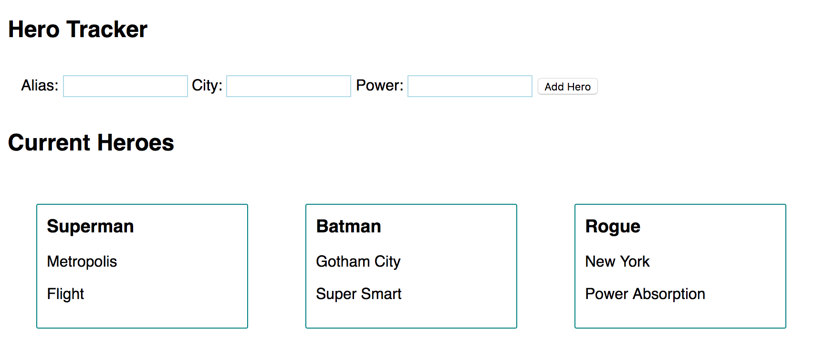

# Code Challenge 5: Angular

_A friendly reminder that this is simply a way for us to see how you are individually doing with the technology. Just relax and show us what you know!_

## Objectives
- Demonstrate understanding of Angular directives and the view model
- Demonstrate understanding of interacting with an Angular Service

## Your Hero Tracker
After hearing about all Psi's great super powers, The Department of Superhero Knowledge needs an app to help track superhero aliases and powers. You are going to build them this app with Angular.

### Hero Entry
This will have a form to fill out and create new heroes. Each hero will have the following information on their record:

* ```alias``` (this is their superhero name)
* ```city```
* ```power```

### Hero Listing
This should show a list of heroes and their information. On page load, all heroes currently in the database should be displayed. When a new hero is added the view should refresh automatically.

## App Interface Example



## To Get Started
- [ ] Fork and clone this repo.
- [ ] The server code has been provide, but you will need to `npm install` to get all the dependancies.
- [ ] Start the server and open the site on [http://localhost:3000/](http://localhost:3000/).

Some of the code has been started for you including all of the server and the Angular `heroService.js` that makes the http calls to the server.

The following files **will** need your attention:

- [ ] On the client side you will need to complete the `script.js` file. Use the `heroService.js`, which is complete, to make requests to your server.

- [ ] `index.html` will need some ng directives to work with `script.js`. Some directives you will need: `ng-app`, `ng-controller`, `ng-model`, `ng-click`, and `ng-repeat`.

No other files will need your attention.
# grunt_activity
